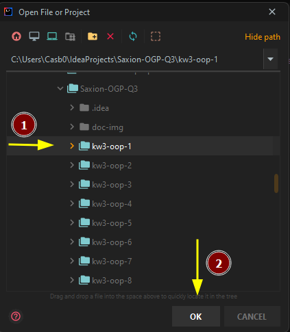
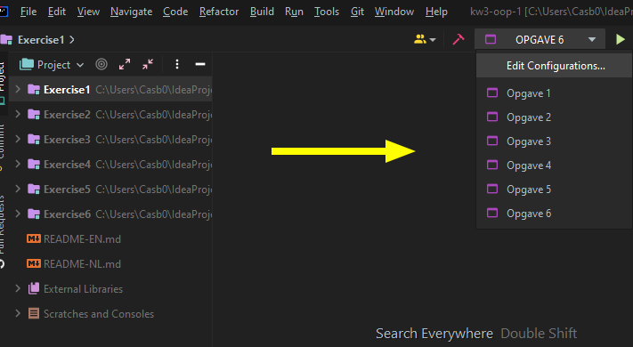

Object georiënteerd programmeren
---

###### Special thanks to [Pim Meulenkamp ](https://github.com/Pimmeul) voor het maken van basis template. Deze is te gebruiken als template op [saxion-kw3-oop-opdrachten-template](https://github.com/Pimmeul/saxion-kw3-oop-opdrachten-template).

In Kwartiel 3 maken we 8 weken opdrachten voor OGP/OOP
In deze repo staan mijn persoonlijke uitwerkingen.

### Openen + uitvoeren:
Documentatie over start scripen staat onder de module inhoud

## Module inhoud:

**`⚠️ Saxion vond het een leuk idee om sommige weken de opgave nummering bij 0 te starten 😑`**

### Project status:

## Week 1: Encapsulation

- [x] **Week 1** 
  - [x] Exercise 1: Train compartment
  - [x] Exercise 2: YouTube Video
  - [x] Exercise 3: Circle
  - [x] Exercise 4: Fueling a car
  - [x] Exercise 5: Airplane
  - [x] Exercise 6: Bingo mill 
  
## Week 2: Complex data structures

- [X] **Week 2**
    - [x] Exercise 1: Rectangle
    - [x] Exercise 2: Validation
    - [x] Exercise 3: Bookcase
    - [X] Exercise 4: A plane with passengers
    - [X] Exercise 5: Yathzee

## Week 3: Inheritance

- [ ] **Week 3**
    - [X] Exercise 0: Buildings
    - [X] Exercise 1: Home automation
    - [X] Exercise 2: Bank accounts
    - [ ] Exercise 3: Multilingualism
    - [ ] Exercise 4: Mentoring students
    - [ ] Exercise 5: Drawing shapes
    - [ ] Exercise 6: Library

## Week 4: Polymorphism

- [ ] **Week 4**
  - [ ] Exercise 0: Hospitality
  - [X] Exercise 1: Introducing the Shape superclass
  - [ ] Exercise 2: Calendar
    - [ ] Bonus: Draw a calendar
  - [ ] Exercise 3: Candy dispenser
  - [ ] Exercise 4: Facebook-ish..
  - [ ] Exercise 5: Putting your class designs to paper
    - [ ] Drawing in draw.io
    - [ ] Create classes in java

## Week 5: Abstraction and interfaces

- [ ] **Week 5**
  - [ ] Exercise 0: Calculations
  - [ ] Exercise 1: Quiz questions
  - [ ] Exercise 2: Zoo
    - [ ] Bonus: Draw a zoo with jailed animals
  - [ ] Exercise 3: Using the `Comparable<T>` interface
  - [ ] Exercise 4: Export to CSV
  - [ ] Exercise 5: Rogier's updated transporting company

## Week 6

- [ ] **Week 6: Bye-bye Saxion-App / Static vs non-static**
  - [ ] Exercise 1: Number guessing game (again)
  - [ ] Exercise 2: Indian dishes
  - [ ] Exercise 3: Styles of programming
  - [ ] Exercise 4: Insurance company
  - [ ] Exercise 5: Parliament elections in the Netherlands 2021 pt.1
  - [ ] Exercise 6: Parliament elections in the Netherlands 2021 pt.2 (tests)

## Week 7
  
- [ ] **Week 7: Exceptions and how to use Javadoc**
  - [ ] Exercise 0: CD Collection
  - [ ] Exercise 1: Reading the file system
    - [ ] Bonus: Subdirectories
  - [ ] Exercise 2: Building and running your programs without IntelliJ
  - [ ] Exercise 3: Parking garage
  - [ ] Exercise 4: The helpdesk software "i-Desk"
  - [ ] Exercise 5: Search Engine

## Week 8
  
- [ ] **Week 8: Sample Exam** 
  - [ ] Exercise 1: Handing out fines (60 min)
  - [ ] Exercise 2: Fitness club "Merlin" (45 min)

---

# Uitleg Uitvoeren in IntelliJ
1. Open een specefieke week, dit is erg belangrijk dat deze apart geopen wordt.
   
2. Voer een week uit, klik niet op de start knoppen in de idea.
   
